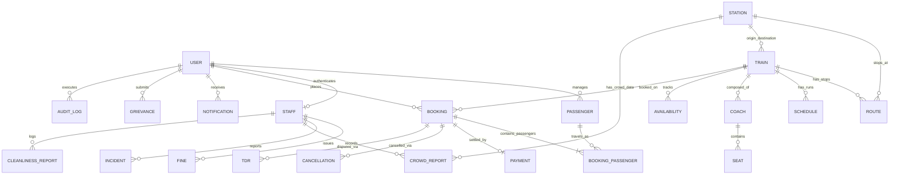

# Data Relationships & Relational Model Architecture

## 1. Overview & ER Diagram

The **Railway Reservation & Management System** is modeled in compliance with the Third Normal Form (3NF). Every non-key attribute is non-transitively dependent directly on its primary key, preventing update and deletion anomalies.

---

## 2. Core Relational Clusters

### 2.1 The User & Identity Cluster
- **`USER` (1) ── (N) `PASSENGER`**:
  A single user account maintains a saved "Passenger Master List" of multiple family members or frequent travelers.
- **`USER` (1) ── (0..1) `STAFF`**:
  When an account has role `"STAFF"`, its authentication profile in `USER` joins 1-to-1 with operational metadata in `STAFF` (such as `employeeId`, `designation`, and `assignedStationId`).
- **`USER` (1) ── (N) `BOOKING`**:
  A user acts as the purchasing customer who owns the booking transaction and PNR.
- **`USER` (1) ── (N) `NOTIFICATION`**:
  Notifications are strictly partitioned per user account to support targeted status updates.
- **`USER` (1) ── (N) `GRIEVANCE`**:
  Users log support tickets and complaints, each tracked individually.

---

### 2.2 The Train, Route, Schedule & Capacity Cluster
- **`TRAIN` (1) ── (N) `ROUTE`**:
  A train service operates over a sequence of stops. Each `ROUTE` record links a `trainId` and `stationId` with an ordered `stopSequence` (1, 2, 3...), arrival/departure times, and cumulative distance from the origin station.
- **`TRAIN` (1) ── (N) `SCHEDULE`**:
  The master train configuration runs on specific calendar dates (`journeyDate`). Operational delays and running statuses (`ON_TIME`, `DELAYED`, `CANCELLED`) belong to this dated schedule run.
- **`TRAIN` (1) ── (N) `COACH`**:
  A train rake is composed of designated coaches (e.g., `A1`, `B1`, `B2`, `S1`, `S2`) characterized by class (`2A`, `3A`, `SL`).
- **`COACH` (1) ── (N) `SEAT`**:
  Every coach has an exact physical layout of seats (e.g., `seatNumber: 1` through `72`), each assigned a structural berth type (`LOWER`, `UPPER`, `MIDDLE`, `SIDE_LOWER`).
- **`TRAIN` (1) ── (N) `AVAILABILITY`**:
  Aggregated availability tokens are partitioned by `(trainId, journeyDate, classType, quota)`.

---

### 2.3 The Booking, Payment & Settlement Cluster
- **`BOOKING` (1) ── (N) `BOOKING_PASSENGER`**:
  One booking transaction generates a single 10-digit `pnr` that can hold 1 to 6 individual passenger line-items.
  - For `CONFIRMED` passengers: `coachNumber` and `seatNumber` are physically allocated.
  - For `RAC` passengers: assigned an RAC coach and shared berth token.
  - For `WAITING_LIST` passengers: `coachNumber` and `seatNumber` remain `null`.
- **`BOOKING` (1) ── (1) `PAYMENT`**:
  Each booking is linked to a payment transaction tracking amount, mode, and gateway reference.
- **`BOOKING` (1) ── (0..N) `CANCELLATION`**:
  A booking may be cancelled wholly or selectively for specific passengers prior to chart preparation, recording the deducted cancellation fee and computed refund.
- **`BOOKING` (1) ── (0..1) `TDR`**:
  In operational failure scenarios, a Ticket Deposit Receipt (TDR) is logged against the booking for special administrative review.

---

### 2.4 Staff Operations Cluster
- **`STAFF` (1) ── (N) `FINE`**:
  Ticket Collectors issue penalties on train or station premises, recorded with violation reasons and payment flags.
- **`STAFF` (1) ── (N) `INCIDENT`**:
  Emergency situations (medical, security, electrical) are reported by staff members to central control.
- **`STAFF` (1) ── (N) `CROWD_REPORT` & `CLEANLINESS_REPORT`**:
  Staff document platform passenger densities and sanitary maintenance tickets.

---

### 2.5 Admin Audit Cluster
- **`USER (ADMIN)` (1) ── (N) `AUDIT_LOG`**:
  Every modification to master records (train timetable edits, fare revisions, account suspensions, TDR approvals) records the admin's `userId`, target `entityType`, `entityId`, timestamp, and before/after payloads.

---

## 3. Segmented Seat Allocation & Seat Integrity Rule

In modern passenger rail management, a single physical train journey traverses multiple intermediate stations. A crucial relational constraint is **Segmented Seat Allocation**:

> **The Segmented Allocation Rule**:
> A specific physical seat (`coachNumber`, `seatNumber`) on a train and `journeyDate` may be allocated to more than one passenger **if and only if their travel segments do not overlap in station stop sequence**.

### Example Scenario
Consider Train 101 with route stop sequence:
1. `BCT` (Mumbai Central) - Stop Sequence 1
2. `ST` (Surat) - Stop Sequence 2
3. `BRC` (Vadodara) - Stop Sequence 3
4. `NDLS` (New Delhi) - Stop Sequence 4

- **Passenger 1** travels from `BCT` (Seq 1) to `ST` (Seq 2) in Coach `B1`, Seat `23`.
- **Passenger 2** wishes to travel from `BRC` (Seq 3) to `NDLS` (Seq 4) on the exact same date and train.
- **Result: VALID & ALLOWED.** The segment $[1, 2]$ does not overlap with segment $[3, 4]$. Seat `B1 / 23` can be legally sold to Passenger 2 for that leg!
- **Passenger 3** wishes to travel from `ST` (Seq 2) to `NDLS` (Seq 4).
- **Result: INVALID & REJECTED** for Passenger 1's segment if Passenger 1 was booked from `BCT` (1) to `BRC` (3), because $[1, 3] \cap [2, 4] \neq \emptyset$.

### Relational Overlap Test Formula
Two bookings for the same physical seat on the same train date overlap if:
$$\max(\text{Start}_A, \text{Start}_B) < \min(\text{End}_A, \text{End}_B)$$
Where $\text{Start}$ and $\text{End}$ are the 1-indexed `stopSequence` values along the route.

When checking availability or allocating a seat, the system checks whether any existing `CONFIRMED` booking passenger occupies the target seat during any station segment $[s_{\text{board}}, s_{\text{dest}})$.

---

## 4. Foreign Key Constraints Reference

| Source Entity | Source Field | Target Entity | Target Field | Cascade Action |
| :--- | :--- | :--- | :--- | :--- |
| `PASSENGER` | `userId` | `USER` | `userId` | `ON DELETE RESTRICT` |
| `STAFF` | `userId` | `USER` | `userId` | `ON DELETE RESTRICT` |
| `STAFF` | `assignedStationId` | `STATION` | `stationId` | `ON DELETE SET NULL` |
| `TRAIN` | `sourceStationId` | `STATION` | `stationId` | `ON DELETE RESTRICT` |
| `TRAIN` | `destinationStationId` | `STATION` | `stationId` | `ON DELETE RESTRICT` |
| `ROUTE` | `trainId` | `TRAIN` | `trainId` | `ON DELETE CASCADE` |
| `ROUTE` | `stationId` | `STATION` | `stationId` | `ON DELETE RESTRICT` |
| `SCHEDULE` | `trainId` | `TRAIN` | `trainId` | `ON DELETE CASCADE` |
| `COACH` | `trainId` | `TRAIN` | `trainId` | `ON DELETE CASCADE` |
| `SEAT` | `coachId` | `COACH` | `coachId` | `ON DELETE CASCADE` |
| `BOOKING` | `userId` | `USER` | `userId` | `ON DELETE RESTRICT` |
| `BOOKING` | `trainId` | `TRAIN` | `trainId` | `ON DELETE RESTRICT` |
| `BOOKING` | `boardingStationId` | `STATION` | `stationId` | `ON DELETE RESTRICT` |
| `BOOKING` | `destinationStationId` | `STATION` | `stationId` | `ON DELETE RESTRICT` |
| `BOOKING_PASSENGER` | `bookingId` | `BOOKING` | `bookingId` | `ON DELETE CASCADE` |
| `BOOKING_PASSENGER` | `passengerId` | `PASSENGER` | `passengerId` | `ON DELETE RESTRICT` |
| `PAYMENT` | `bookingId` | `BOOKING` | `bookingId` | `ON DELETE RESTRICT` |
| `CANCELLATION` | `bookingId` | `BOOKING` | `bookingId` | `ON DELETE RESTRICT` |
| `TDR` | `bookingId` | `BOOKING` | `bookingId` | `ON DELETE RESTRICT` |
| `NOTIFICATION` | `userId` | `USER` | `userId` | `ON DELETE CASCADE` |
| `GRIEVANCE` | `userId` | `USER` | `userId` | `ON DELETE RESTRICT` |
| `FINE` | `staffId` | `STAFF` | `staffId` | `ON DELETE RESTRICT` |
| `INCIDENT` | `reportedBy` | `STAFF` | `staffId` | `ON DELETE RESTRICT` |
| `CROWD_REPORT` | `stationId` | `STATION` | `stationId` | `ON DELETE RESTRICT` |
| `CROWD_REPORT` | `recordedBy` | `STAFF` | `staffId` | `ON DELETE RESTRICT` |
| `CLEANLINESS_REPORT`| `reportedBy` | `STAFF` | `staffId` | `ON DELETE RESTRICT` |
| `AUDIT_LOG` | `userId` | `USER` | `userId` | `ON DELETE RESTRICT` |
